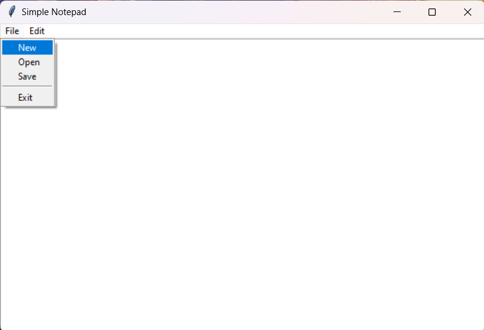

To add images of your Notepad UI in the README, you can follow these steps:

1. **Take Screenshots** of your Notepad application's user interface (UI).
   
2. **Upload the Images** to your project directory (e.g., in a folder named `images`).

3. **Reference the Images** in your README using Markdown syntax.

Here’s how you can modify the README template to include images:

---

# Notepad Application

A simple notepad application built using Python and the Tkinter library. This notepad allows users to create, edit, and save text files in a minimal interface.

## Features

- **Create New Files:** Start a new text file from scratch.
- **Open Existing Files:** Open and edit text files from your system.
- **Save Files:** Save your current work in `.txt` format.
- **Cut/Copy/Paste:** Basic clipboard functionality for text manipulation.
- **Text Formatting:** Adjust font style, size, and color (if included).
- **Keyboard Shortcuts:** Common shortcuts like `Ctrl+N`, `Ctrl+S`, `Ctrl+O`, etc., for ease of use.


## Installation

1. Clone the repository:
   ```bash
   git clone https://github.com/yourusername/notepad-tkinter.git
   ```
2. Install the necessary dependencies:
   ```bash
   pip install tk
   ```

## Usage

Run the `notepad.py` file to launch the application:
```bash
python notepad.py
```

## Requirements

- Python 3.x
- Tkinter (included with standard Python installation)



## License

This project is licensed under the MIT License - see the [LICENSE](LICENSE) file for details.


